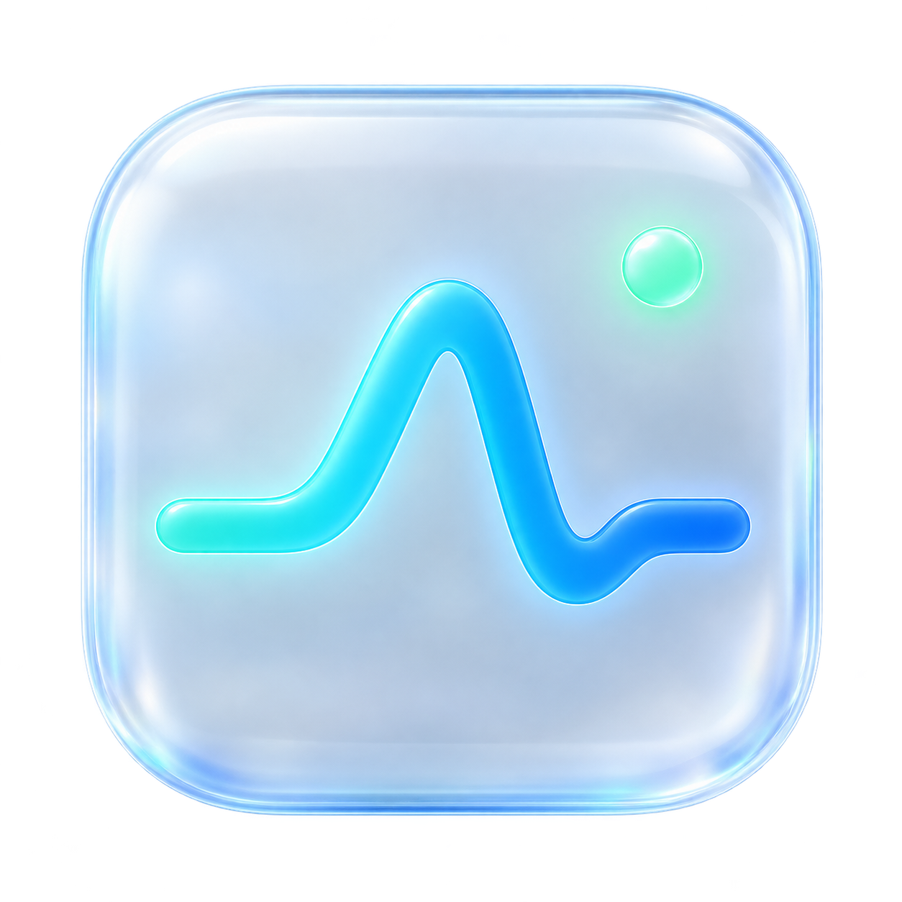
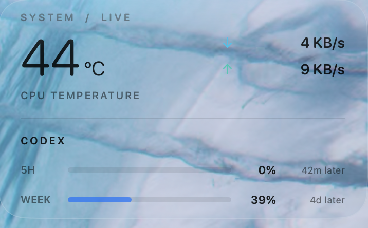

<p align="center">
  
</p>

<h1 align="center">Glass Metrics</h1>
<p align="center">一个安静的 macOS 桌面监控卡片：CPU 温度、实时网速、Codex 订阅额度。</p>

<p align="center">
  
</p>

使用 Swift、SwiftUI 和 AppKit 构建。Apple Silicon 优先，macOS 26+ 使用原生 Liquid Glass，较早系统使用 material 背景。没有菜单栏图标；拖动移动，右键设置或退出。

## 功能

- **温度**：一个代表性的 CPU 核心平均温度，优先使用 Apple Silicon HID 传感器，必要时尝试已知 SMC 键。
- **网速**：下载和上传速度，只取网络字节计数，不读取或显示 IP 地址。
- **Codex**：显示 5 小时及每周**剩余额度比例**与距重置的大致时间。这不是剩余 token 数，也不是 API 余额。
- **桌面卡片**：约 360 × 214 pt；可拖动、记住位置、调节背景厚度、选择桌面层或始终置顶。
- **独立刷新**：调整一个模块不会提高其他模块的采样频率。
- **故障恢复**：错误分类、手动刷新、自动退避重试、官方浏览器登录、可选系统 HTTP 代理。

| 模块 | 默认刷新 | 可选间隔 |
| --- | --- | --- |
| 网速 | 1 秒 | 1 / 2 / 5 / 10 秒 |
| 温度 | 5 秒 | 1 / 2 / 5 / 10 / 30 / 60 秒 |
| Codex | 2 分钟 | 30 秒 / 1 / 2 / 5 / 10 分钟 |

设置修改后立即重新安排采样，并自动保存。定时器允许少量合并误差，以减少唤醒。

## 系统要求

- Apple Silicon Mac（当前构建目标为 `arm64`）。
- macOS 15 或更新版本；Liquid Glass 需要 macOS 26 或更新版本。
- 从源码构建需要 Xcode 26+ 或包含相应 macOS SDK 的开发工具；目前在 Xcode 27 / macOS 27 上验证。
- Codex 模块需要本机可运行的官方 Codex CLI，以及能返回订阅限额的 ChatGPT 登录。温度、网速不依赖 Codex。

Intel、不同芯片型号和旧系统尚未逐一验证。温度传感器属于系统内部接口，系统升级可能改变可用性；没有有效读数时显示 `—`。

## 构建与运行

在仓库根目录运行：

```sh
./build.sh
open ./GlassMetrics.app
```

构建仅使用系统开发工具，不拉取第三方包。生成的 `GlassMetrics.app` 位于仓库根目录；缓存和中间文件在临时目录中自动清理。应用使用本地 ad-hoc 签名，尚未作为 Developer ID 签名、公证的正式发行包发布。需要跨设备分发时，应另行完成签名与公证。

长期使用可将应用复制到 `/Applications` 或 `~/Applications`，再在设置中开启“登录时启动”。以后移动应用位置，需要重新设置登录项。源码构建不自动安装或开启登录项。

### 基本操作

- 左键拖动卡片任意内容区域，位置自动保存。
- 右键 → **设置…**：调整刷新、透明度、置顶、登录启动和 Codex 连接。
- 右键 → **立即刷新 Codex**：无需等待定时查询。
- 右键 → **退出**：结束应用及正在进行的 Codex 查询。
- 默认留在桌面层，会被普通应用窗口遮住；需要覆盖其他窗口时开启“始终置顶”。
- 已运行时再次打开应用，会显示设置窗口。

## 配置 Codex

### 1. 准备官方 CLI

按 [OpenAI 官方 Codex CLI 指南](https://learn.chatgpt.com/docs/codex/cli)安装 CLI，然后检查：

```sh
codex --version
codex login status
```

Glass Metrics 会搜索常见 CLI 安装位置，包括 `~/.local/bin`、Homebrew 路径、`~/.cargo/bin`、进程 `PATH`，以及部分官方桌面应用中的内置 CLI（仅在对应文件存在时使用）。

如果自动发现失败，打开 **设置 → Codex → 选择 Codex…**，选择真实的 `codex` 可执行文件。用 nvm 等工具安装的 CLI，尤其可能需要手动选择。选择的文件必须能正常运行 `codex app-server --listen stdio://`。

### 2. 登录 ChatGPT 账户

如果本机 Codex 已经通过 ChatGPT 登录，点击 **立即刷新**即可。

否则，打开 **设置 → Codex → 登录 Codex**。应用通过官方 App Server 发起登录，并打开系统浏览器。完成浏览器中的 ChatGPT 登录后，卡片自动查询额度；可以取消，等待超过三分钟也会结束。浏览器无法打开时，也可在终端执行：

```sh
codex login
```

完成后回到卡片点击 **立即刷新**。

登录由官方 Codex 管理。Glass Metrics 不自行保存密码、OAuth token 或登录链接；它复用 CLI 的账户配置。**在这里切换账户会影响使用同一 Codex 配置的其他工具。** 通常使用默认的 `~/.codex`；若你为终端设置了自定义 `CODEX_HOME`，需确保启动卡片时继承同一个环境，否则两个程序可能看到不同的登录状态。

API Key、第三方 API 提供商、Bedrock 等登录方式不等同于 ChatGPT 订阅限额。没有 5 小时或周窗口时，相应位置显示 `—`，不会按 0% 或 100% 猜测。

### 3. 网络与代理

打开 **设置 → Codex → 使用系统 HTTP 代理**，可让 GUI 启动的 Codex 子进程读取 macOS 手动 HTTP/HTTPS 代理设置。该选项默认开启；没有配置系统代理时正常连接。

- 已经设置的 `HTTP_PROXY`、`HTTPS_PROXY`、`ALL_PROXY` 等环境变量优先。
- 仅 PAC 自动代理配置不在当前支持范围内。
- 应用不修改系统代理、不切换网络模式，也不记录代理地址。
- 使用代理软件时，请先确认软件运行、系统代理开启，再点击“立即刷新”。

### 4. 查询失败时怎么办

| 提示 | 含义与处理 |
| --- | --- |
| 未找到 Codex | 安装官方 CLI，或在设置里选择可执行文件。 |
| Codex 启动失败 | 在终端检查 `codex --version`；确认 CLI 配置能正常加载，必要时更新或重新选择文件。 |
| 需要重新登录 | 点“登录 Codex”，或运行 `codex login`。认证过期时会先尝试一次官方 token 刷新。 |
| 网络连接失败 / 查询超时 | 检查网络及代理，点“立即刷新”；程序也会自动重试。 |
| 查询暂时被限流 | 稍后重试或延长间隔。查询被限流不代表订阅额度已用完。 |
| 服务暂时不可用 | 等待自动重试，或查看 [OpenAI 服务状态](https://status.openai.com/)。 |
| 访问被拒绝 | 检查账户访问权限、网络和代理；持续失败再尝试重新登录。 |
| 需要更新 Codex / 响应格式异常 | 更新官方 CLI，确认使用的可执行文件正确。 |
| 暂无订阅限额 | 当前登录方式、账户或服务响应没有提供所需窗口。 |

临时错误按约 30、60、120 秒逐步延长重试，最长约 10 分钟。缺少 CLI、需要登录等错误会降低自动尝试频率，可随时手动刷新。设置中显示上次成功时间、下次尝试时间和安全的错误代码。

**暂时查不到时不会把额度变成零。** 同一次运行中会保留上次成功数据，降低进度条透明度并标明“旧数据”；旧数据不表示实时余额。登录失效或主动重新登录时会清空旧账户数据。退出应用后不保存限额缓存。

## 资源占用与隐私

三个采样器互相独立。网速读取系统计数器；温度复用 HID 服务；Codex 使用短生命周期的原生子进程。Glass Metrics 不包含 Electron，也不需要一个常驻 Node 服务。没有查询和登录时，不保留 app-server 子进程。

目前的小样本实测：

| 场景 | 结果 | 测量范围 |
| --- | --- | --- |
| v0.2，网速 1 秒刷新、静置 30 秒 | 平均约 0.83% 单核 CPU，57.9 MiB RSS | 仅卡片进程，不含周期性 Codex 查询 |
| v0.4，单次真实 Codex 查询 | 子进程约 0.217 CPU 秒，峰值 RSS 110.4 MiB；此次请求约 6.8 秒完成 | 单次请求，网络等待也计入完成时间 |

它属于轻量常驻工具，但 Liquid Glass 绘制、采样唤醒和 CLI 启动仍有开销。RSS 包含共享内存，以上数据不是电池续航或瓦特测量，也不保证其他机器一致。若更重视续航，可降低网速采样频率并延长 Codex 查询间隔。

温度和网速本地处理；Glass Metrics 不采集公网 IP、不上传监控指标，也没有自己的遥测服务。Codex 登录和限额网络请求由官方 CLI 处理，其行为仍受 CLI 自身配置影响。错误界面仅保留错误类别和代码，不展示任意原始服务响应。

## 开发与测试

```sh
./test.sh          # 离线协议与故障测试
./test.sh --live   # 另检查真实温度、网速和已登录 Codex 的限额
```

离线测试使用系统开发工具附带的 Python 3 模拟 App Server，不需要真实账户；测试会自动清理临时进程和文件。`--live` 需要正常本机权限、网络以及已经登录的 CLI。浏览器登录使用模拟协议回调测试，不会在测试中替换真实账户。

测试覆盖：分片响应、初始化顺序、大量 stderr、超时、取消、子进程回收、认证刷新、登录回调匹配、登录 URL 校验、错误脱敏、旧数据保留及账户数据清理。

```text
Sources/App.swift          窗口、设置、独立定时器与恢复策略
Sources/Samplers.swift     温度与网速采样
Sources/CodexClient.swift  App Server 通信、登录、错误分类
Native/SMC.c               HID / SMC 温度读取
Resources/                应用图标与 Info.plist
Tests/                    离线及真实环境检查
```

贡献和问题反馈欢迎提供 macOS 版本、芯片型号、Codex CLI 版本及设置中显示的错误类别/代码。请不要提交账户凭据、`auth.json`、原始 OAuth URL 或包含敏感内容的日志。

当前网速统计范围为启用的 `en*` 接口，主要覆盖 Wi-Fi 和以太网；不提供逐应用流量，也不将 VPN 虚拟接口重复叠加。温度是核心聚合值，可能与 Stats 中选择的某个单独传感器不同。

## 致谢

这个项目受益于以下开源项目和公开资料：

- **[exelban/stats](https://github.com/exelban/stats)**：主要温度实现参考，包含 Apple Silicon CPU 传感器命名、SMC 键和 HID 采样思路。感谢 Serhiy Mytrovtsiy 及贡献者长期维护这些硬件知识。改编部分保留 MIT 许可说明。
- **[Javis603/token-monitor](https://github.com/Javis603/token-monitor)**：Codex 限额监控及统一小组件的产品和实现思路参考。本项目独立实现原生 App Server 客户端，未引入其 Electron 界面或运行时。
- **[fermion-star/apple_sensors](https://github.com/fermion-star/apple_sensors)** 及其注明的上游 **[freedomtan/sensors](https://github.com/freedomtan/sensors)**：Apple Silicon HID 温度事件 API 声明及采样方式参考；保留原作者 “freedom” Koan-Sin Tan 的 BSD 3-Clause 说明。
- **[beltex/SMCKit](https://github.com/beltex/SMCKit)**：SMC 接口与数据读取方面的参考阅读，没有作为运行时依赖打包。
- **[openai/codex](https://github.com/openai/codex)** 与 [官方 App Server 文档](https://learn.chatgpt.com/docs/app-server)：提供账户、限额和浏览器登录协议。

本项目与上述项目及 Apple、OpenAI 没有官方隶属关系。商标归各自所有者。

## 许可证

新编写的项目代码使用 [MIT License](LICENSE)。参考、改编部分的原始版权和许可见 [THIRD_PARTY_NOTICES.md](THIRD_PARTY_NOTICES.md)，该文件也随应用打包。应用图标由 AI 辅助生成。
